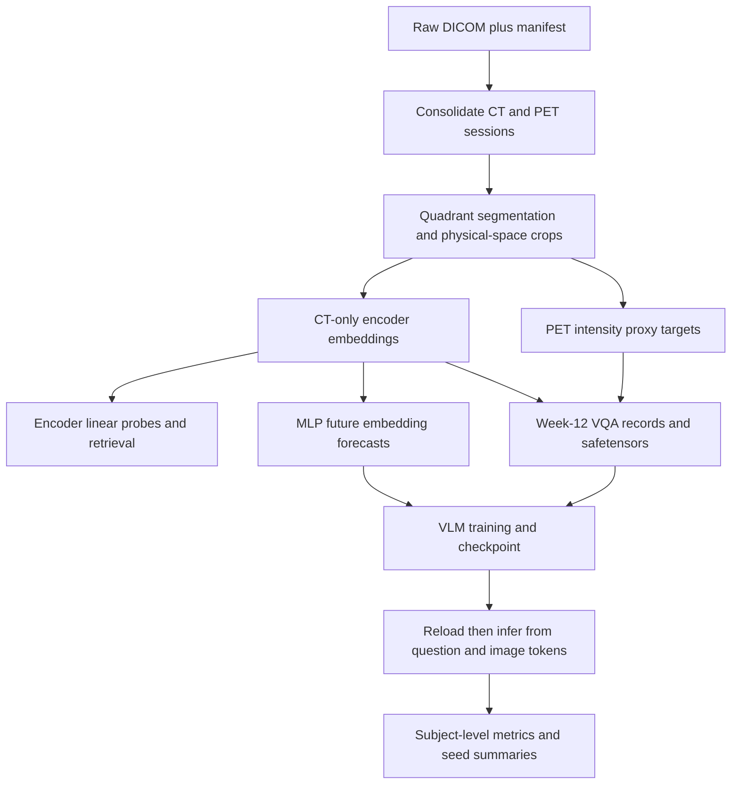

# Codebase map and research state — 2026-09-14

> Historical pre-repair code and job snapshot. For current entry points use [current code navigation](../CODEBASE_CURRENT.md); for current findings use [status](../STATUS.md). The old symbol index and active-session descriptions below are dated evidence.

The [master closure plan](../MASTER_PLAN.md) tracks the work needed to resolve these findings and establish a valid next experiment.

Read `RESEARCH_AUDIT.md` first. Earlier README/FINDINGS summaries are historical evidence, not an authoritative current verdict. In particular, the new checkpoint defect undermines the inference that the negative VLM numbers establish a trained-model failure.

**End-to-end data flow**



**Pipeline ownership and contracts**

| Stage | Files / main entry points | Output / audit concern |
|---|---|---|
| Study inventory | `manifest.csv`, `docs/DATA_MANIFEST.md`, `quadrant_overrides.yaml` | Acquisition metadata; filename-based mouse order is the working assumption. |
| DICOM conversion and crops | `scripts/build_nifti_dataset.py`: `consolidate_sessions`, `segment_animals`, `crop_to_physical_bbox`, `stage3_crop_and_write` | `/data1/Processed_NIfTI_Test/{sessions,mice,mouse_manifest.csv}`; mixed CT/PET source scans and cache provenance require care. |
| Encoders | `scripts/get_{raddino,colipri,merlin,m3d}_embeddings.py` | `.npz` contract: embeddings, subject_ids, weeks, modalities, paths. All four currently contain 229 CT scans / 78 mice; dimensions 768/768/2048/768. |
| Encoder evaluation | `scripts/evaluate_embeddings.py`, `scripts/eval_stats.py` | Per-fold standardization; T2b/T2c can use connected mouse-group holdout. Refit permutation is optional, not the default. Other tasks do not all inherit that grouping. |
| Forecast embeddings | `scripts/train_longitudinal.py`: `build_pairs`, `train_fold`, `save_rollout_embeddings` | NaF only, 56 consecutive pairs / 32 mice; default no genotype conditioning, baseline rollout, training-fold norm scaling. Global OOF exports are not nested within VLM folds. |
| Proxy labels | `scripts/extract_tbr_features.py` | `longitudinal/tbr_features_NaF.csv`; VQA uses `tbr2_p95_median`. These are not validated aortic measurements. |
| VQA generation | `scripts/create_mouse_traj_dataset.py` | 96 records / 32 baseline-eligible NaF mice; genotype, TBR, combined. Questions' requested horizons depend on observed future availability. |
| Paraphrases | `scripts/dataset/create_mouse_vqa_dataset_from_openai.py`, `crump_aug_dataset.csv`, `aug_config_mouse.yaml` | Rewords templates; does not add independent animals. BraTS sibling script is adaptation/reference code. |
| Dataset loading | `vlm/data/vqa_dataset.py`: `MouseTrajDataset` | Loads ts0 safetensors and global forecast npys; missing forecasts silently become zeros. Parses TBR from answer text. |
| Model | `vlm/model/vision_language_model.py` | 768→4096 projection, LoRA LLaMA, genotype and four-slot TBR heads. Critical adapter serialization defect; question-versus-answer pooling. |
| Training and inference | `vlm/model/viz_emb_trainer.py`, `vlm/utils/huggingface_utils.py` | Seeds construction, computes train-fold TBR statistics, trains, saves, reloads, generates text and evaluates question-context heads. |
| Cross-validation | `vlm/run/run_mouse_vlm_loso.py` | Subject splits; optional inner validation; final epoch by default; appends aggregate predictions and deletes weights. No fold-specific forecast construction or resume fingerprint verification. |
| Single-run development | `vlm/run/run_mouse_vlm_single.py` | Fixed split; imports GPU initialization. Useful for a repaired-model smoke test, not the reported CV result. |
| Scoring | `vlm/data/eval.py` | AUROC from genotype-only records; TBR collapsed by mouse/slot; conditional bootstrap and fixed-score permutation; plain pooled R². |
| Seed summaries | `scripts/aggregate_seeds.py` | Per-seed means/SD and a rank-pooled statistic; not an ordinary ensemble metric. Ties use sequential ranks despite the average-rank comment. |
| Older comparison | `scripts/evaluate_encoder_vs_vlm.py` | Separate unstandardized probes, legacy forecast path, hardcoded VLM summaries; unsuitable as an authoritative comparison. |
| QA / exploration | `scripts/qa_*`, `scripts/visualize_nifti.py`, `docs/qa_2026-09-13/*`, notebook | Visual crop checks, scanner-air statistics, plots. Some evidence scripts retain machine-specific paths. |
| Test suite | `tests/{unit,torch,pipeline,control}` | Synthetic invariants and diagnostic controls. Existing gate is 59/60, with one stale structural assertion; lacks production checkpoint equivalence. |

**Experiment state**

At the first full artifact snapshot (07:52 UTC on September 14), corrected baseline `mouse_vlm_nogeno_base_ep20_f20` had 18/32 subjects, normalized longitudinal `mouse_vlm_nogeno_long_ep20_f22` had 6/32, and normalized question-EOS longitudinal `mouse_vlm_nogeno_long_ep20_f22_qeos` had 5/32. These are progress counts, not result comparisons. The later timestamped JSON snapshot may contain additional completed folds. The tmux sessions are `vlm_f20_base`, `vlm_f22_long`, and `qeos_f22`, using GPUs 5, 6, and 4 respectively.

All ten original no-genotype seed runs have 96 records / 32 subjects and no duplicate pid/qid pairs in the inspected aggregate files. Older partial `_f20` and `_qeos_seed0` longitudinal directories also exist; their names do not establish completion. Original leaky runs and sweeps are retained under separate directories. Active runs inherit the bad checkpoint path.

The configuration matrix lives in `vlm/yaml/`. Canonical defaults and `_nogeno_*` variants still use answer-EOS unless explicitly suffixed/configured otherwise. Most historical experiment headers retain obsolete “headline” descriptions. `--all-data` in the LOSO runner defaults to the fixed JSON and does not derive the all-record file from YAML; augmented LOSO runs must specify it explicitly. Machine paths are also hardcoded in several scripts. `environment.yml` and `requirements.txt` do not fully capture the installed VLM stack (notably PEFT/bitsandbytes).

**New audit evidence and commands**

Run from the repository root. Use a separate tmux session for sustained CPU work; these commands download no model weights and do not change production data.

```bash
CUDA_VISIBLE_DEVICES='' OMP_NUM_THREADS=1 OPENBLAS_NUM_THREADS=1 HF_HUB_OFFLINE=1 \
  .venv-test/bin/python scripts/audit_checkpoint_roundtrip.py

OMP_NUM_THREADS=1 MKL_NUM_THREADS=1 OPENBLAS_NUM_THREADS=1 PYTHONWARNINGS=ignore \
  .venv-test/bin/python scripts/audit_research_artifacts.py

OMP_NUM_THREADS=1 MKL_NUM_THREADS=1 OPENBLAS_NUM_THREADS=1 PYTHONWARNINGS=ignore \
  .venv-test/bin/python scripts/audit_group_permutation.py

CUDA_VISIBLE_DEVICES='' OMP_NUM_THREADS=1 OPENBLAS_NUM_THREADS=1 \
LD_LIBRARY_PATH=/home/ryab/miniconda3/envs/vlm_env/lib \
  .venv-test/bin/python scripts/audit_merlin_cache.py

CUDA_VISIBLE_DEVICES='' OMP_NUM_THREADS=1 OPENBLAS_NUM_THREADS=1 \
LD_LIBRARY_PATH=/home/ryab/miniconda3/envs/vlm_env/lib \
  .venv-test/bin/python -m pytest -m 'not probe and not realdata' -q
```

`code_index.json` indexes top-level classes/functions, source line counts, and SHA-256 hashes for the Python files in scripts, vlm, and tests. It is a navigation/provenance artifact, not a claim that every branch has been dynamically tested. Raw studies, model weights, and private machine configuration are not bundled here.
# Post-repair navigation

The map above records the audit snapshot. [The repair-time symbol index](code_index_current.json) describes that implementation snapshot; [current navigation](../CODEBASE_CURRENT.md) includes the subsequent experiments. The [closure report](PIPELINE_CLOSURE.md) is evidence for the original study.

The validated path is now `create_mouse_traj_dataset.py` → `build_nested_forecasts.py` → `run_mouse_vlm_loso.py` → `aggregate_seeds.py` / `finalize_validated_results.py`. Structured targets and fold normalization live in `vlm/utils/target_contract.py`; atomic artifacts and forecast provenance in `research_io.py`; frozen run identities and completion checks in `run_contract.py`; strict paired scoring in `vlm/data/validated_metrics.py`; canonical adapter loading in `checkpoint_utils.py`.

The independent data/repair checks are `validate_research_inputs.py`, `recompute_existing_pet_proxy.py`, `validate_encoder_repairs.py`, `validate_nested_rollout.py`, `validate_projected_tokens.py`, and `validate_merlin_regeneration.py`. The last script refreshes existing Merlin comparison metrics using the repaired cache and full-refit group-label inference.
