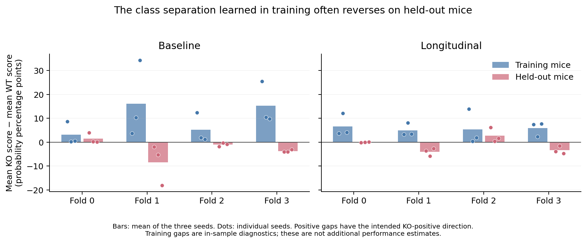

# Why small genotype score differences point the wrong way

The four-fold amendment is complete: all 24 fits passed artifact checks, and independent standard-library pair counting reproduces all six within-fold AUROCs and accuracies. The scores remain weak: baseline AUROC 0.5161 / 0.4839 / 0.4355; longitudinal 0.4194 / 0.4516 / 0.4516. The severe original LOSO reversal is reduced, but this does not establish useful genotype discrimination or a longitudinal advantage. Because training size also changed, the improvement over old LOSO scores is not a pure measurement of pooling bias.

## The direction is correct during training and often wrong on held-out mice

All 24 saved models were strictly reloaded. Every held-out genotype logit reproduced exactly. In **24/24 models**, the mean KO probability is higher than the mean WT probability on training mice. The label mapping and learned training direction agree; there is no global sign reversal.

The longitudinal models have median training AUROC 0.7133. On held-out mice, the class-mean probability gap is negative in 8/12 models. For example, longitudinal seed 0 / fold 1 has a training KO-minus-WT gap of **+3.32 percentage points**, but its held-out KO mean is **45.21%**, below the WT mean of **48.85%**: a gap of **−3.64 points**. Subtracting a common offset or moving a threshold cannot repair that within-model ordering.

The small deviations are not independent coin flips. The same mice and split recur across seeds. Of the 62 within-fold KO–WT pairs, the longitudinal model gets 30 wrong in all three seeds, 24 right in all three, and eight inconsistently. Shared data/split effects can therefore produce repeated negative results across seeds without a global inversion in the code. Those 62 pairs overlap in subjects and are not independent trials; this is not a significance calculation.

## A similar failure is already visible in the baseline image features

As a diagnostic, compare each held-out baseline RAD-DINO vector's cosine similarity to the KO and WT means calculated from its training fold. This uses no VLM, longitudinal forecast, trained classification head, or parameter search. Its test-fold AUROCs are 0.8125, 0.3125, 0.6000 and 0.3333, giving a pair-weighted 0.5161. The same folds that fail persistently in the VLM also show wrong-direction separation in this simple feature comparison.

This supports an unstable image cue that fits the small training population but fails on particular held-out mice. It does not prove there is no recoverable genotype information in the images, or establish whether feature limitations versus optimization is the dominant constraint. The data's genotype/diet/acquisition confounding remains. The centroid diagnostic is not an added benchmark arm or a selected replacement metric.

## Why the threshold produces mostly WT predictions

The training KO proportion is 10/24 or 11/24: **41.7% or 45.8%**. If the image contributes little, a BCE classifier can minimize its loss near that proportion, below the fixed 50% decision threshold. An uncertain prediction below 50% is therefore compatible with learning the class prior; uncertainty alone does not imply a symmetric 50/50 output.

The longitudinal models detect only **2, 2 and 1 of the 14 KO mice**, with **4, 3 and 1 false-positive WT calls** across seeds. Starting from the always-WT predictor's 18 correct mice, those deviations produce `18 + 2 − 4 = 16`, `18 + 2 − 3 = 17`, and `18 + 1 − 1 = 18` correct classifications: accuracy 50.0%, 53.1% and 56.25%. The small departures from a majority-class default are often unhelpful.

The outputs are not all confined to 0.4–0.6: 16, 20 and 17 of 32 longitudinal predictions lie in that interval. Some fitted models are nearly constant well below it. For example, longitudinal seed 1 / fold 0 has held-out probability SD only 0.0027, while its training predictions include strong positive responses to a few KO mice. This is consistent with recognizing limited training patterns while providing little separation for the held-out animals; it is not evidence of a generally learned genotype detector.

## What numerical precision and cross-fitting explain

Repeating saved-model inference with the bfloat16 autocast used during training changes only **two of 96 longitudinal threshold decisions** (zero of 96 baseline decisions). It changes some near-tied rankings, but longitudinal AUROCs remain 0.4355 / 0.4274 / 0.4516. Numerical precision contributes to fragile small margins; it does not resolve the poor discrimination. These alternate-precision scores are diagnostics and do not replace the frozen reported scores.

The original LOSO seed-0 longitudinal class-mean logit gap was −0.1741. An exact descriptive decomposition places −0.1087 in differences between the models' mean responses on their training inputs, and −0.0655 in held-out deviations from those means. This is consistent with a substantial cross-model component, but the mean-response term also reflects training feature composition; it is not a causal percentage attributed solely to class priors.

Training longitudinal scores were also grouped by the five forecaster fits that generated their input tokens. Within those groups, training discrimination generally remains; it does not disappear when comparisons across forecaster fits are removed. This check does not support a simple claim that all apparent training genotype signal is an arbitrary forecast-fit identifier. It also does not eliminate subtler differences between inner-cross-fitted training tokens and outer-training test tokens.

## Interpretation and limits

The final per-question check strictly reproduced all 96 held-out head outputs from the four longitudinal seed-0 models. Genotype-question mean training scores are 0.401, 0.413, 0.472 and 0.444, versus training KO proportions 0.417, 0.417, 0.458 and 0.458. Across all three question types, means are 0.397, 0.417, 0.469 and 0.425. Question-specific defaults differ somewhat, but this check does not reveal a genotype-question-only inversion or a large universal suppression caused by the shared head. It is a diagnostic of saved eval-mode outputs, not a calibration assessment or a proof of optimization convergence.

The evidence currently supports **a weak, unstable image-to-genotype mapping, plus majority-class defaults and the original cross-model evaluation bias**. A globally inverted genotype label/head and checkpoint corruption are contradicted by direct checks. Numerical precision is a minor contributor to threshold behavior. The investigation has not established that a single additional code patch will recover genotype signal, and no threshold, sign or model setting has been selected to improve these results.

Evidence: [all-model diagnostic](genotype_separation.json), [raw threshold counts](threshold_saved_predictions.json), [forecast-fit diagnostic](forecast_fit_diagnostic.json), [per-question diagnostic](genotype_prompt_context.json), [verified results](RESULTS.md), [independent scoring](independent_metrics.json). The per-question check covers the four longitudinal seed-0 models; the train/test and precision checks cover all 24 models.
